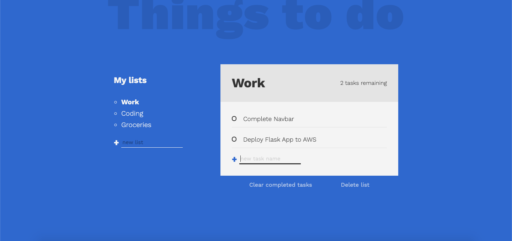

### Docket

- A Simple TODO Web App. 🔖 ⏳
- Create Multiple categories and Work on it. 🖥   🏋️   🎨   🛒 
- Delete it by category or completed tasks on a particular category when done. 🗑 
- Uses your Local storage to store the values. 🛢

